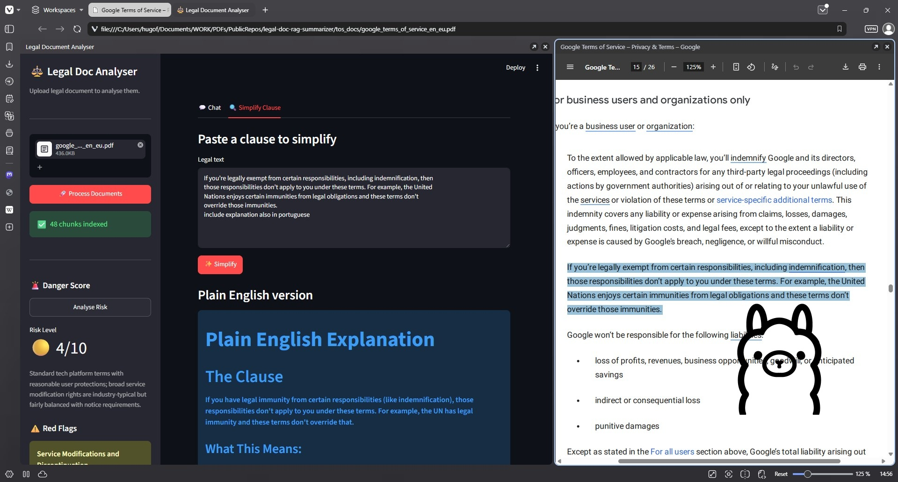
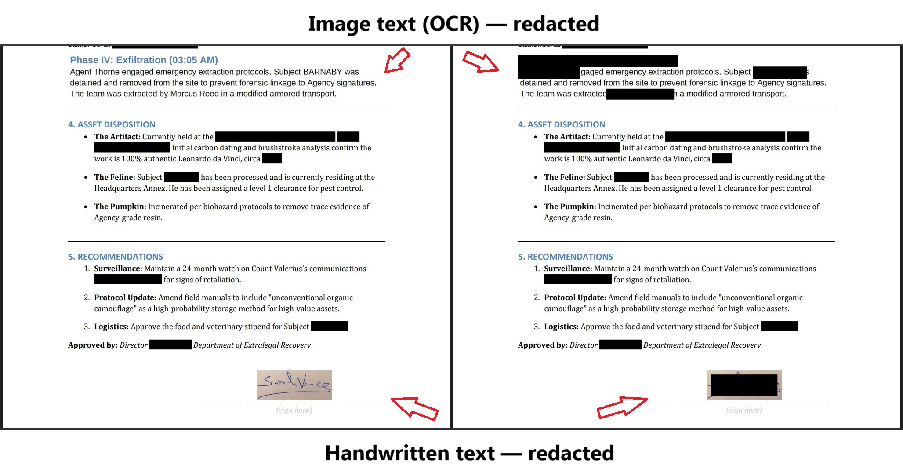
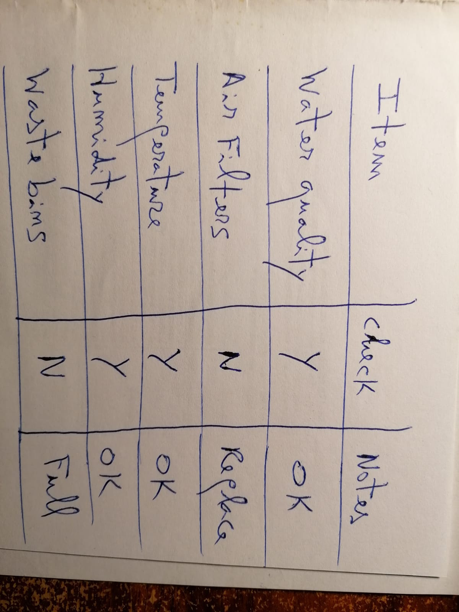

# 🤖 my-ai-portfolio

Portfolio showcase of my AI and machine learning projects. Each project is hosted in its own repository, with a brief description, key features, and preview images (if applicable). Built with tools like Hugging Face, LlamaIndex, and Python.

**Goal:** Share my journey learning and building with AI, from RAG pipelines to agentic workflows.

---

# [👉 legal-doc-rag-summarizer-v2-hybrid](https://github.com/hasff/legal-doc-rag-summarizer-v2-hybrid)

> 🗓️ Status: June 2026

## A hands on RAG tutorial for legal document analysis: this time going hybrid, pairing a local LLM with Claude.

**Tags:** `#rag` `#tutorial` `#step-by-step` `#claude-api` `#bm25` `#huggingface` `#streamlit` `#ollama`
---

# [👉 legal-doc-rag-summarizer](https://github.com/hasff/legal-doc-rag-summarizer)

> 🗓️ Status: June 2026

## A RAG pipeline that reads legal PDFs, answers questions about them, scores their risk, and simplifies legalese into plain English — built with Python, HuggingFace embeddings, BM25, and the Claude API.

**Tags:** `#rag` `#tutorial` `#step-by-step` `#claude-api` `#bm25` `#huggingface` `#streamlit`

---

# [👉 mcp-release-notifier](https://github.com/hasff/mcp-release-notifier)

> 🗓️ Status: June 2026

## Agentic pipeline that listens to GitHub releases, generates professional release notes with AI, and delivers a PDF to Discord — built with MCP, FastAPI, and the Claude API.

**Tags:** `#mcp` `#modelcontextprotocol` `#tutorial` `#step-by-step` `#claude-api` `#mcp-server` `#mcp-client`

--- 

# [👉 claude-invoice-agent](https://github.com/hasff/claude-invoice-agent)

> 🗓️ Status: May 2026

## Extract client data from PDF invoices — name, address, phone, amount owed — and export everything to a formatted Excel file. Automatically. Powered by the Claude API and Tool Use.

**Tags:** `#tooluse` `#demo` `#claude-api`

--- 

# [👉 python-pdf-sensitive-data-redactor](https://github.com/hasff/python-pdf-sensitive-data-redactor)

> 🗓️ Status: March 2026

## Automatically detect and permanently redact sensitive personal information from PDF files — text, embedded images, and metadata — using Python and AI.

**Tags:** `#gemini` `#demo` `#pymupdf`

---

# [👉 python-handwritten-ocr-document-generator](https://github.com/hasff/python-handwritten-ocr-document-generator)

> 🗓️ Status: March 2026

## Extract structured data from handwritten images using Google Gemini and export it automatically to PDF, Excel and Word documents.

Handwritten

**Tags:** `#gemini` `#demo` `#reportlab` `#openpyxl` `#docx`

---

